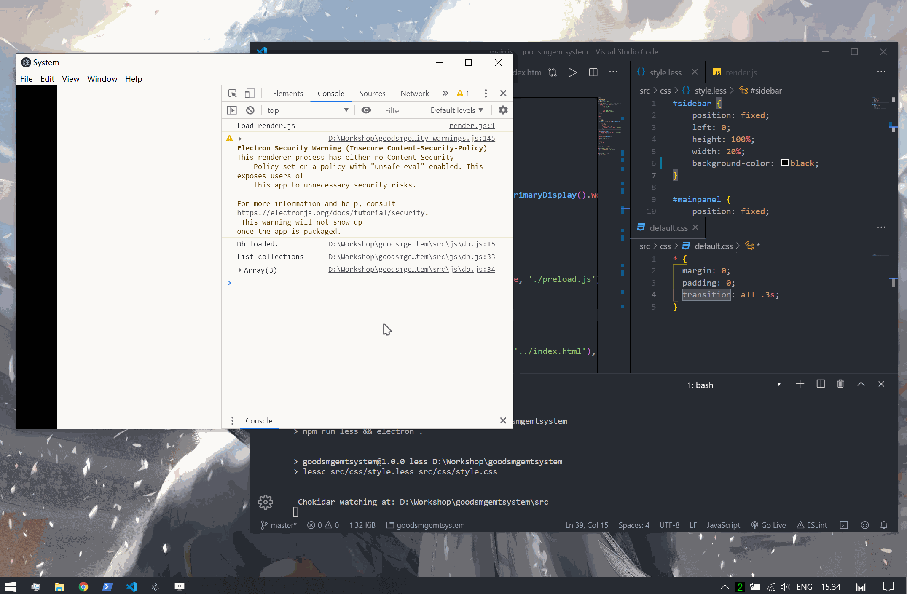

## :rocket: Electron Nice Auto Reload 

 [](https://www.npmjs.com/package/electron-nice-auto-reload) 

**Reload your electron app nicely while developing !!!**

### Relaunch,Reload,Run-Script

If you want to relauch the app while we make some change in `main.js`



Or you just happen to change a css file, and it just need to reload the window:


Somehow you want more, you want to run a npm command while you change your `.less` file and it need to run command to generate a new css file:


### Install

``` bash
npm i electron-nice-auto-reload
```

### How To Use

`require`  in your main process

``` javascript
require('electron-nice-auto-reload')({
    rootPath: ...,
    rules: [],
    ignored: ...(pass to chokidar),
    log: true,
    devToolsReopen: true
})
```

e.g.

``` javascript
require('electron-nice-auto-reload')({
    rootPath: path.join(process.cwd(), 'src'),
    rules: [
        {
            // run lessc while style.less file is changed
            // and this script will change the style.css
            // hence reload all windows
            action: 'script',
            target: 'style.less',
            // lessc src/css/style.less src/css/style.css
            script: 'npm run less'
        },
        {
            // relaunch the app while main process related js files
            // were changed
            action: 'app.relaunch',
            target: 'preload.js|main.js'
        }
    ],
    ignored: /node_modules/,
    log: true,
    devToolsReopen: true
})
```

then start your electron app and develop it

#### Options

- `rootPath`: the root path which **chokidar** is watching

- `rules`:

  ``` javascript
  // Structure:
  //    options.rules = [rule1, rule2, ...]
  //    rule = {
  //       action: 'app.relaunch' | 'win.reload' | 'script',
  //       target: regex,
  //       script: string
  //    }
  ```

  - **action** means we can relaunch the app, reload all the [BrowserWindow]( https://electronjs.org/docs/api/browser-window ) or even run script with [node child_process.exec()]( https://nodejs.org/dist/latest-v12.x/docs/api/child_process.html#child_process_child_process_exec_command_options_callback ). By default it is `'win.reload'`
  - **target** means a regex string for matching a bunch of files for specific action
  - **script** means the script you use to run

- `ignored`: same as **chokidar**. By default it is `/node_modules|[/\\]\./`
- `log`: means to show the log or not. By default it is `false`
- `devToolsReopen`: means to reopen the devTools when the win.reload action is perform(to avoid some css style might misplace) By default it is `false`